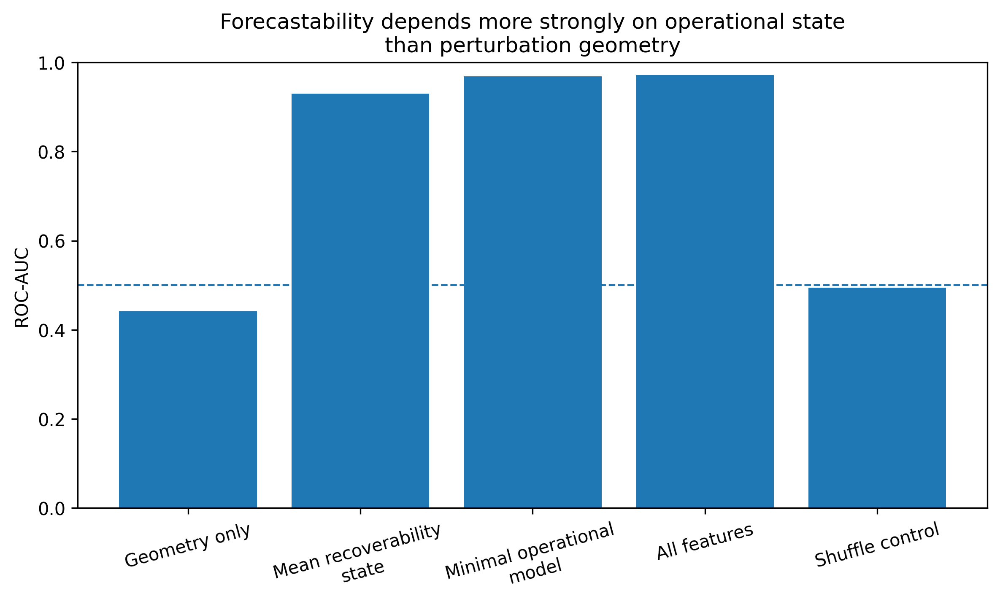

# ERC Accessibility Forecasting

<p align="left">
  <a href="https://creativecommons.org/licenses/by/4.0/">
    
  </a>

  <a href="https://doi.org/10.5281/zenodo.20451294">
    
  </a>
</p>

*Minimal recoverability-constrained forecasting framework for operational accessibility deterioration.*

**Can future accessibility deterioration become operationally forecastable before explicit collapse?**

This repository accompanies an exploratory computational forecasting note investigating whether future accessibility deterioration becomes forecastable from present recoverability state rather than perturbation geometry alone.

⸻

## Main result



Forecastability emerges more strongly from operational recoverability state than from perturbation geometry alone.

Perturbation structure alone exhibits weak predictive signal, whereas present operational recoverability observables strongly forecast future deterioration. Randomized label controls collapse predictive performance toward chance levels.

⸻

## Key findings

* Perturbation geometry alone shows weak predictive performance (ROC-AUC ≈ 0.44)
* Mean recoverability state alone strongly forecasts future deterioration (ROC-AUC ≈ 0.93)
* Minimal operational observables recover near-maximal predictive signal (ROC-AUC ≈ 0.97)
* Shuffle-target controls collapse performance toward chance (ROC-AUC ≈ 0.50)
* Forecastability persists across future horizons (Δt = 10–40)

⸻

## Conceptual framing

This work explores a minimal operational distinction between:

### Preserved mapping

The structural scaffold of formally available trajectories.

### Realized routing

The subset of trajectories that remain dynamically traversable under recoverability constraints and perturbation history.

Under this framing:

> **Preserved structure does not necessarily imply preserved future accessibility.**

⸻

## Repository structure

```text
erc-accessibility-forecasting/

├── data/
│   ├── exported forecasting datasets
│   ├── forecasting metrics
│   └── permutation importance tables
│
├── figures/
│   ├── publication figures
│   ├── ROC analysis
│   └── forecasting diagnostics
│
├── notebooks/
│   └── reproducible forecasting notebook
│
├── papers/
│   └── accompanying computational note (PDF)
│
├── LICENSE.md
├── CITATION.cff
└── README.md
```

⸻

## Reproducibility

The repository includes:

* Reproducible forecasting notebook
* Exported simulation datasets
* Forecasting metrics
* Permutation importance analysis
* Forecast horizon robustness analysis
* Publication figures

All analyses are designed to remain reproducible, modifiable, and falsifiable under alternative assumptions, perturbation schedules, forecasting targets, and recoverability constraints.

⸻

## Citation

If you use this repository, please cite:

> Ojeda, J. (2026). *ERC Accessibility Forecasting: A Recoverability-Constrained Computational Forecasting Note* (Version 1.0.1). Zenodo. https://doi.org/10.5281/zenodo.20451294

DOI:

[https://doi.org/10.5281/zenodo.20451294](https://doi.org/10.5281/zenodo.20451294)

GitHub citation support is enabled.

⸻

## License

This repository is released under:

Creative Commons Attribution 4.0 International (CC BY 4.0)

You are free to share, adapt, and reuse the material with attribution.

[Creative Commons Attribution 4.0 International](https://creativecommons.org/licenses/by/4.0/)
